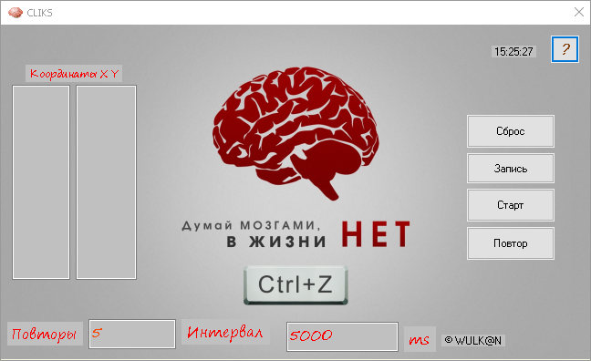
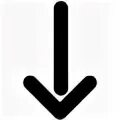
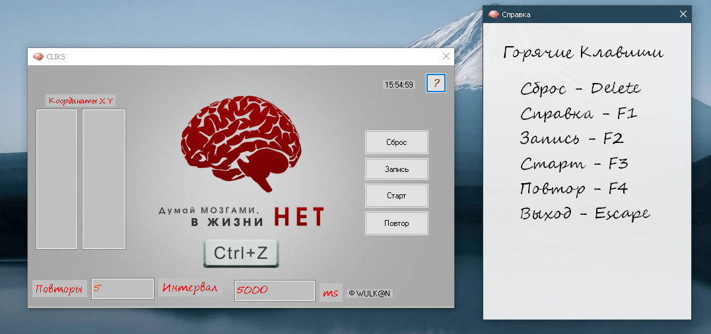

# CLIKS - Автокликер для Windows

 <!-- Опциональный баннер -->

[](https://opensource.org/licenses/MIT)
[](https://support.microsoft.com/ru-ru/windows)
[](https://dotnet.microsoft.com/ru-ru/languages/csharp)
[](https://dotnet.microsoft.com/ru-ru/download/dotnet-framework)
[](https://github.com/your-username/CLIKS/releases)
[](https://github.com/your-username/CLIKS/releases)

Программа для автоматизации кликов мышью с поддержкой координат, интервалов и повторов.

## 🚀 Возможности
- 📌 Задание точных координат (X,Y) вручную или по кардиналам
- ⏱️ Настройка интервала между кликами (мс)
- 🔁 Указание количества повторов
- 🖱️ Поддержка левой/правой кнопки мыши
- 💾 Сохранение профилей настроек
- 🛡️ Работает на Windows 7-11

## 📦 Скачать
Последнюю версию можно скачать в [разделе релизов](https://github.com/your-username/CLIKS/releases).

[](https://github.com/your-username/CLIKS/releases/latest)

## 🖥️ Скриншот интерфейса


## ⚙️ Использование
1. Запустите `CLIKS.exe`
2. Введите координаты (X,Y) или выберите точку на экране
3. Задайте параметры:
   - Интервал (мс)
   - Количество повторов
   - Кнопка мыши
4. Нажмите "Старт"

```bash
Пример: 5 повторений с интервалом 500ms на позиции (100,200)
